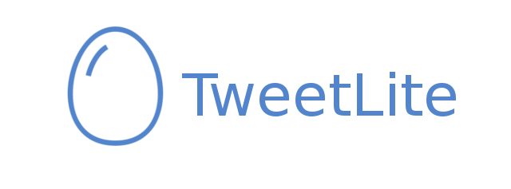

<p align="center">
  
</p>

# Install
```sh
npm install -g twitbot@0.3.0
```
# Usage
User add
```sh
twitbot profile
```

User remove
```sh
twitbot flush
```

Twitbot version
```sh
twitbot version
```

Search keywords, followed users, favorited twet
```sh
twitbot search
```

Twitbot automate message
```sh
twitbot message
```

Unfavorite all yours favorites
```sh
twitbot unfavorite
```

Unfollowed all nonfollowers users
```sh
twitbot unfollow
```

Follow live tweting keywords and follow,favorites
```sh
twitbot watch
```

| params        | value         |
| ------------- |:-------------:|
| noPrompt     | true |
| account     | johndoe      |
| follow | yes      |
| favorite | yes      |
| lang | en,tr,vs     |

### Watch Blacklist and middleware

```js
 exports.use = () => { // must be exports use
	 return async function(twet, args){ // twet and extra cli arguments
     try {

       this.use({
         retweet : {
       		path: 'statuses/retweet',
       		method: 'post'
       	}
       })

       const result = await this.retweet({id:twet.id})

       if (result){
         return true
       } else {
         return new Error('idk wtf happens')
       }

     } catch (err) {
       return err
     }
	 }
 }

exports.blacklist = (args) => { // must be exports blacklist
  return function (twet) {
  		return twet.text.includes('#yolo') && twet.user.id !== args.blockid;
  }
}
```
Run your middleware
```sh
twitbot watch src=~/drop/twitter-retwet/index.js --account=johndoe --blockid=1243434
```


Your twitbot middleware
```sh
twitbot use
```
| params        | value         |
| ------------- |:-------------:|
| account     | johndoe      |
| src | ~/twitbot-bumps      |

### Write Yours middlewares

```js
 exports.use = () => { // must be exports use
	 return function(args){ // extra cli arguments

     console.log(args); // { yolo:true }

     this.search({q:'#yolo'}).then( data => { // twitbot avaible this
       console.log(data)
     })

     setInterval(function () {

      console.log('Ping Pong!');

		 }, 2000);

	 }
 }
```
Run your middleware
```sh
twitbot use src=~/drop/twitter-bumps/index.js --account=johndoe --yolo=true
```

## Twitbot middlewares
[twitbot-automate](https://github.com/c0b41/twitbot-automate)
[twitbot-moco](https://github.com/c0b41/twitbot-moco)
[twitbot-nonfollowers]()

## Twitbot Debug

```sh
env DEBUG="twitbot:cli,twitbot:core,twitbot:util,twitbot:core:util" twitbot search
```
